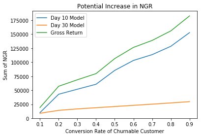

# Employing Churn Prediction and Customer Value Prediction Models to Increase Sales for an Online Casino

This project demonstrates how a casino can maximize the value of every player by predicting churn and calculating customer lifetime value (CLTV). The goal is to optimize promotional efforts, encourage player engagement, and ultimately increase net revenue by targeting players with personalized incentives. The notebook explores how to predict the probability of a player leaving the casino and how to calculate their lifetime value.

## Project Overview

Online casinos aim to retain high-value players by offering tailored bonuses and promotions. The challenge is to predict which players are at risk of churning and to assess their potential lifetime value to optimize the casino's marketing efforts. By leveraging machine learning models for churn prediction and CLTV prediction, casinos can strategically allocate resources to retain valuable players.

## Dataset

The dataset consists of 25,000 rows of player transaction data collected from their first deposit date to 3 months after. It includes:

- **Player Information**:
  - `customer_id`
  - `acquisition_source`
  - `country`
  - `gender`
  - `date_first_deposit_id`
  - `date_registration_id`

- **Transactional Data** (aggregated per player and transaction date):
  - `date_transaction_id`
  - `count_deposit`
  - `sum_deposit`
  - `sum_free_spin`
  - `sum_bonus_cost`
  - `sum_ngr`
  - `sum_bet_real`
  - `sum_bet_bonus`
  - `sum_win_real`
  - `sum_win_bonus`

## Notebooks

### 1. [Get Data](notebooks/1_get_data.ipynb)
This notebook focuses on loading the provided `task_data_set.CSV` file, exploring the contents with quick descriptive statistics, ensuring data quality, and enhancing the dataset with additional geographic data (latitude and longitude for each country). The cleaned dataset is then exported as a pickle file for later use.

### 2. [EDA and Feature Engineering](notebooks/2_EDA_WhichModel_FeatureEngineering.ipynb)
Here, I perform exploratory data analysis (EDA) to determine the most suitable models for maximizing casino net revenue. The goal is to predict the net gaming revenue (NGR) per player, defined as:
$$ \text{NGR} = \text{Bets} - \text{Wins} - \text{Bonus Cost} - \text{Tax} $$

The notebook explores different visualizations and conducts feature engineering to understand patterns that could help in churn prevention and identifying high-value players. Key insights include:

- **Churn patterns**: A significant proportion of players churn quickly (within 10 days). Targeting these players early could prevent loss.
- **Early retention**: Players who do not churn within the first 10 days have a higher potential for long-term value.

### Strategy
To increase NGR per player:
1. **10-Day Mark**: After 10 days since a player's first transaction, run the churn prediction model to determine if the player is likely to churn. For those not at risk of churning, no changes are made. For high-risk players, implement a customer value prediction model to offer tailored promotions and bonuses.
2. **30-Day Mark**: Repeat the churn prediction process for players at the 30-day mark and adjust promotional efforts accordingly.

### 3. [Preprocessing](notebooks/3_PreProcessing.ipynb)
This notebook preprocesses the data for modeling. It includes:
- Scaling continuous data
- Encoding categorical variables
- Imputing missing values

The following models are built to predict churn and customer lifetime value (CLTV) for different time frames (10 days and 30 days):

1. **Churn Prediction for 10-Day History**:
   - Model: Binary classifier
   - Target: `df_players[churn_10]`

2. **Customer Value Prediction for 10-Day History**:
   - Model: Multi-class classifier
   - Target: `df_ngr[CLTV]`

3. **Churn Prediction for 30-Day History**:
   - Model: Binary classifier
   - Target: `df_players[churn_30]`

4. **Customer Value Prediction for 30-Day History**:
   - Model: Multi-class classifier
   - Target: `df_ngr[CLTV]`

### 4. [Modeling](notebooks/4_Modelling_*.ipynb)
In this set of notebooks, different models are implemented and evaluated based on performance metrics such as recall, ROC AUC, F1 score, and accuracy. The following models were tested:

- **Churn Prediction (10 days)**: Ensemble model combining Gradient Boosting, Random Forest, Decision Trees, and Naive Bayes.
- **Churn Prediction (30 days)**: Ensemble model combining Gradient Boosting, Random Forest, Logistic Regression, and Naive Bayes.
- **Customer Value Prediction (10 days)**: Ensemble model combining Gradient Boosting, Random Forest, Decision Trees, and Logistic Regression.
- **Customer Value Prediction (30 days)**: Ensemble model combining Gradient Boosting, Random Forest, Decision Trees, and Logistic Regression.

The 30-day model outperforms the 10-day model, as expected, due to the longer time window capturing more player behavior.

### 5. [Deploying the Model](notebooks/5_Deploying_the_model.ipynb)
This notebook demonstrates how to deploy the model for practical use. It walks through an example of selecting 1,000 customers, predicting their churn probability, and determining their CLTV. The potential return from applying the model is also calculated, illustrating how even a modest conversion rate can generate significant returns.

#### Potential Return from Strategy:
- **10-day churn prediction**: 32% of players identified as churnable, with 53 high-value players identified.
- **30-day churn prediction**: 5% churnable players, with 21 high-value players identified.

## Conclusion

By leveraging churn prediction and customer value prediction models, casinos can strategically target high-value players with personalized promotions, improving player retention and ultimately increasing net revenue. The models developed in this project offer a powerful tool for driving better decision-making in online casino marketing strategies.

## Future Work

- Further refinement of the churn prediction and CLTV models.
- Integration of additional data sources to improve predictions.
- Deployment of models into a production environment for real-time predictions.
