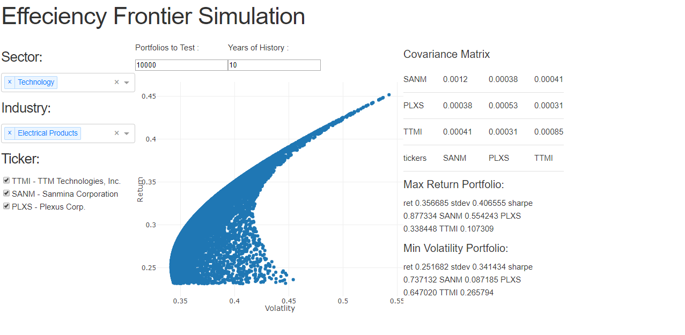

# Portfolio Optimization using Markowitz Efficiency Frontier and Dash

Modern Portfolio Theory (MPT), introduced by Nobel laureate Harry Markowitz, is foundational in finance for balancing risk and return. In this project, I present an app that calculates the Efficiency Frontier using data from the Quandl API. The app provides key insights, including the Efficiency Frontier plot, a covariance matrix, and optimal portfolios for maximum return and minimum volatility—enabling users to visualize and optimize portfolio performance.

## Description

The project explores the concept of Modern Portfolio Theory (MPT) and provides an interactive application built using Dash, which calculates and visualizes the **Efficiency Frontier** based on stock data. The app allows users to:

- View the Markowitz Efficiency Frontier plot, showcasing the relationship between portfolio return and volatility.
- View the covariance matrix for the selected stocks.
- See the optimal portfolios for maximum return and minimum volatility.

The app is built to give users valuable insights into portfolio optimization, allowing them to visualize how different stocks perform together in a portfolio and how to balance risk and return.

## Categories

- Blog

## Tags

- Analytics
- Feature-Engineering
- Financial-Analysis

## Key Features

- **Markowitz's Efficiency Frontier**: Visualizes the trade-off between risk and return for a portfolio.
- **Covariance Matrix**: Shows the correlation between selected stocks' returns.
- **Optimal Portfolio**: Displays the portfolio with the highest return and the one with the minimum volatility.
- **Interactive Dashboard**: Built using Dash to provide an interactive experience for users to select stock tickers and adjust parameters.

## Getting Started

### Requirements

To run this application locally, you'll need the following Python libraries:

- `dash`
- `pandas`
- `numpy`
- `plotly`
- `quandl`

Install the necessary dependencies using pip:

```bash
pip install dash pandas numpy plotly quandl
```

### Running the App
1. Clone this repository:
    ```
    git clone https://github.com/zerafachris/playGround.git
    cd playGround/published/EFT
    ```
2. Obtain your Quandl API key by signing up at (Quandl)[https://www.quandl.com/], then set it as an environment variable or replace it directly in the code.

3. Run the Dash app:
    ```bash
    python eft_app.py
    ```
    This will start a local server at http://127.0.0.1:8050/, where you can interact with the app.


### Code Overview
This project consists of the following key components:
1. **Data Fetching**: The app fetches stock data from Quandl. Note that the data is limited to 2018-02-17 due to API refresh constraints.
2. **Portfolio Simulation**: A function, effFrontierSim, simulates portfolios based on the number of experiments and the number of years of historical data to consider.
3. **Visualization**: The app displays:
    - The Markowitz Efficiency Frontier (Left panel)
    - The covariance matrix of the selected stocks (Top right)
    - The portfolios with maximum return and minimum volatility (Bottom right)
You can find the code for the app in the [`eft_app.py`](https://github.com/zerafachris/playGround/blob/master/published/EFT/eft_app.py) file.

### Example Snapshot
Here is a screenshot of the app in action:


## References
- [Harry Markowitz on Wikipedia](https://en.wikipedia.org/wiki/Harry_Markowitz)
- [Modern Portfolio Theory on Wikipedia](https://en.wikipedia.org/wiki/Modern_portfolio_theory)
- [Markowitz's Original Paper](https://www.math.ust.hk/~maykwok/courses/ma362/07F/markowitz_JF.pdf)

## Questions
For any questions, issues, or feedback, please open an issue or submit a pull request.