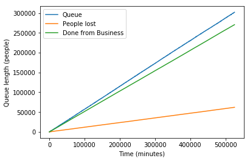

# Simulating a Queue in a Post Office

This repository contains a Python simulation of a queue system at a post office. The simulation models how customers arrive, wait to be served by clerks, and leave without service under specific conditions. It tracks various metrics such as customer arrival rates, service completion, idle times, and customers leaving the queue.

The simulation runs over the course of one year (365 days), tracking key aspects of the queuing system. By simulating customer behavior and clerks' actions, this analysis provides insights into the efficiency of the queue system and how various parameters (e.g., service times, arrival rates) influence the operation of a post office.

## Problem Description

At a post office, customers enter a single line, waiting to be served by one of two clerks. The simulation models the following:

- Every minute, there is a **60% chance** that a new customer arrives at the post office.
- If no one is in line and a clerk is free, the customer is immediately served.
- If a customer is being served, there is a **25% chance** every minute that the customer completes their transaction and leaves.
- Every minute, there is a **5% chance** that a person in the queue will leave without being served.
- The post office is open 24/7/365.

### Key Metrics Tracked in the Simulation:
1. **Queue Length**: The number of customers waiting in line at any given time.
2. **Customers Leaving**: The number of customers who leave the queue without being served.
3. **Completed Transactions**: The number of customers who complete their business and leave the post office.
4. **Clerk Idle Time**: The percentage of time clerks are not serving customers.
5. **Average Time in Post Office**: The average time customers spend in the post office, including those who leave without service.

## Results
After running the simulation, the following key results were calculated:

1. *Average Time Spent in the Post Office*: 250,513.16 minutes.
2. *Percentage of Customers Who Leave Without Being Served*: 9.78%.
3. *Percentage of Time Clerks Are Idle*: 0.00%.

## Visualizations:
The simulation produces a plot illustrating the dynamics of the queue, people leaving, and those completing their business over time: 

## Conclusion
This simulation provides valuable insights into the functioning of a post office queue. The results demonstrate the average time customers spend in the post office, the percentage of customers who leave without service, and the efficiency of the clerks. By analyzing these metrics, one can assess the overall efficiency of the service and explore potential optimizations to reduce wait times and clerks' idle times.

For further analysis, the model could be expanded to simulate different post office configurations (e.g., more clerks, varying arrival rates) or consider additional factors such as customer priorities or service time distributions.

For more details, you can explore the [Python code](https://github.com/zerafachris/playGround/blob/master/Queueing/Queueing.ipynb) and original [Octave code](https://github.com/zerafachris/playGround/blob/master/Queueing/queueing.m).