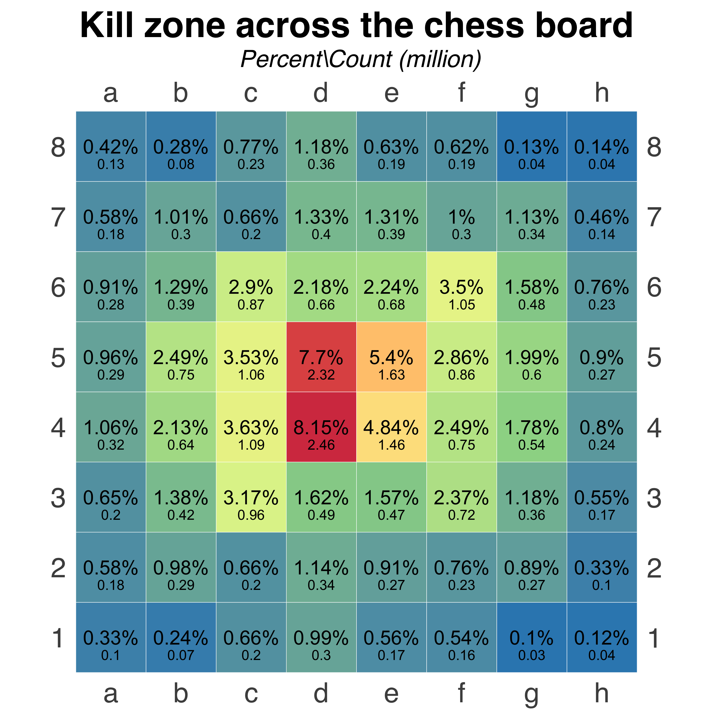
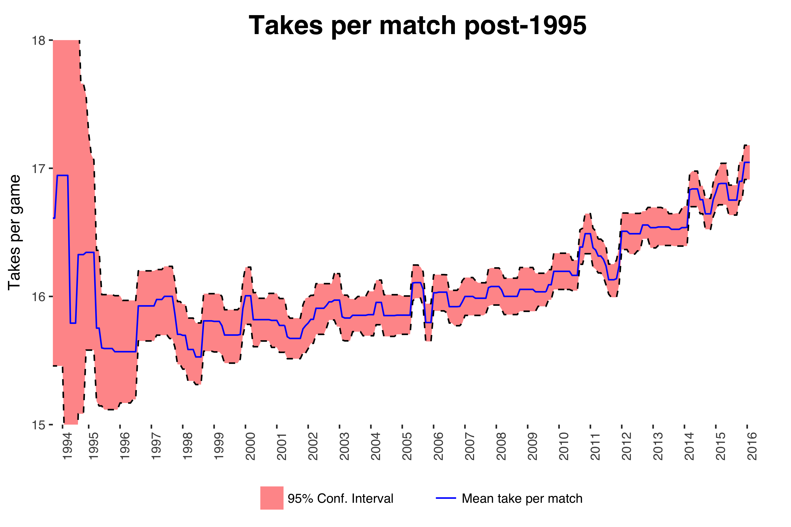
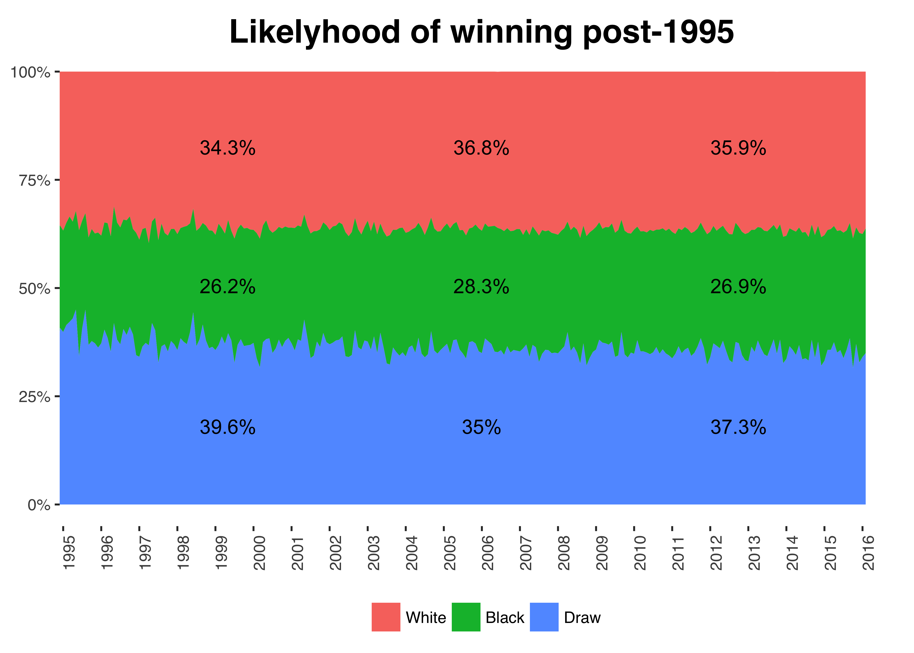
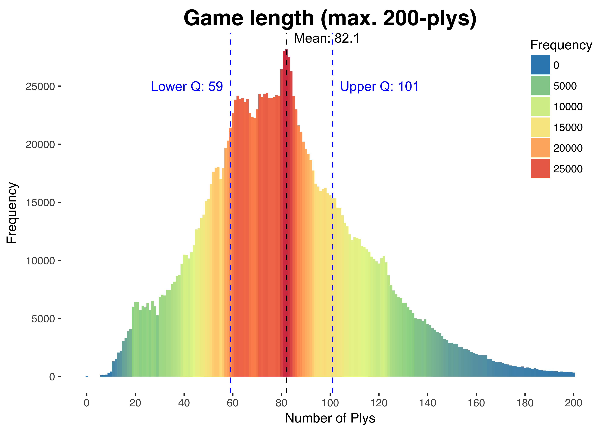

# Chess Analytics

This repository presents a series of visualizations and analyses based on the Kingbase dataset, a collection of 1.8 million chess games in Portable Game Notation (PGN) format. The dataset provides a wealth of information for analyzing trends, strategies, and patterns in competitive chess.

In this project, I use the dataset to generate insights into key elements of chess games, such as move concentration, game length, average game ply, and the advantage of playing white. These visualizations help to highlight evolving strategies and the dynamics of competitive play.

## Key Insights from the Analysis

1. **Move Concentration:** The analysis reveals which chessboard cells receive the most attention during gameplay. Notably, there is a high concentration of moves around the center, particularly on cells d4 and d5. 
   
2. **Increasing Game Length:** Over time, chess games have been getting longer, possibly indicating a shift toward more defensive play strategies. 
   
3. **Average Game Ply:** The dataset shows that 50% of games fall between 59-101 plys, with an average game length of 82 plys. 

4. **White's Advantage:** The analysis confirms that white generally has a slight advantage in chess. Interestingly, a draw for the black player can be considered a 'win' since they begin at a disadvantage. 

## How It Works

- **Dataset:** The Kingbase dataset, consisting of 1.8 million PGN-format chess games, is used for analysis.
- **Visualizations:** Developed using R, the visualizations provide insights into move distribution, game length trends, average ply, and color advantage.
- **Code:** The code for generating these visualizations and analyses is available in the Jupyter Notebook in this repository.

## Requirements
- R

## Links
Full article: [Chess Analytics](https://github.com/zerafachris/playGround/blob/master/published/chessAnalytics/ChessAnalytics.ipynb)