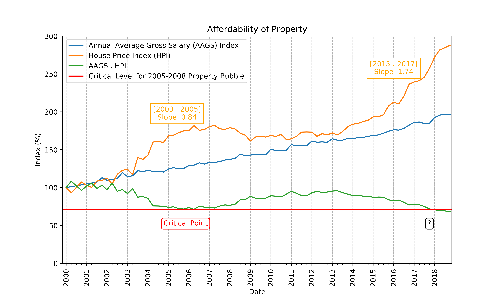

# Malta Property Bubble Analysis

The Maltese property market has recently seen a dramatic surge in property prices, leading many to wonder whether we are experiencing a property bubble. While various opinions circulate in the media, this analysis takes a data-driven approach to objectively assess the state of the market and determine if a property bubble truly exists. Through empirical data and key indicators, we explore the current condition of the Maltese property market beyond the noise of media speculation.

## Project Overview
In this project, I examine the Maltese property market by analyzing historical price data and relevant market indicators. The goal is to identify trends, quantify the rate of increase in property prices, and compare these to other economic indicators to assess the presence of a property bubble.

The analysis is conducted using **Excel**, where I explore various key metrics such as:
- Historical Property Index (HPI)
- Affordability trends
- Average annual growth rates (AAGS)

## Feature Engineering

In this section, we discuss the pre-processing steps and feature engineering carried out to derive meaningful insights for the analysis of the Maltese property market. Specifically, the key features created were the **House Price Index (HPI)**, **Annual Average Gross Salary (AAGS)**, and the **AAGS:HPI ratio**.

### House Price Index (HPI)
The **House Price Index (HPI)** was already available and did not require significant manipulation. This index reflects the change in property prices over time, with a base value set in 2000. Since the HPI was provided in this form, it could be directly used for analysis without further transformation.

### Annual Average Gross Salary (AAGS)
The **Annual Average Gross Salary (AAGS)** dataset required more attention to ensure its accuracy and comparability over time:
- **Currency Conversion**: Initially, the salary data was provided in Maltese Lira. To align with modern standards, the values were converted to **Euros (EUR)** using the conversion rate of **1 Maltese Lira = 2.32937 EUR**.
- **Handling Missing Data**: There were missing salary data points for the period **2000-Q1 to 2001-Q4**. To fill these gaps, I employed a **linear interpolation** technique, estimating the missing salary data by using the surrounding available data.

### Conversion of AAGS to an Index
To allow for an apples-to-apples comparison with the HPI, the **Annual Average Gross Salary (AAGS)** was converted into an index, similarly pegged at **2000** (the base year for the HPI). This conversion allowed us to track the relative change in wages over time, with both the HPI and AAGS now comparable on the same scale.

### AAGS:HPI Ratio (Affordability)
Once both the **HPI** and **AAGS** were available as indices pegged to the year 2000, I derived the **AAGS:HPI ratio**. This ratio represents the **affordability** of properties over time. It is a measure of how much salary is required, relative to property price levels, to purchase a property.

This **AAGS:HPI ratio** can be considered a key indicator of property affordability:
- A **higher ratio** suggests that property prices are becoming more expensive relative to salaries, indicating reduced affordability.
- A **lower ratio** indicates that properties are becoming more affordable relative to salaries.

By creating these new features, the analysis provides a clearer view of how the relationship between property prices and salaries evolves over time, shedding light on the potential presence of a property bubble in the Maltese market.

## Key Findings

### 1. Are we in a property bubble?
**Yes**, we are definitely in a property bubble. The current rate of increase in the **Housing Price Index (HPI)** is growing at a much faster rate than the **Average Annual Growth Rates (AAGS)**, indicating that property prices are escalating beyond what would be considered sustainable. This situation is eerily similar to the 2005-2008 property bubble.

### 2. How big is the bubble?
The rate of increase of HPI is represented by the orange number at the top of the increasing side of the graph. This number clearly shows that the current bubble is growing at a much steeper rate than before, with the slope of the bubble being **twice as aggressive** as the previous property bubble.

### 3. When will it burst?
:sparkles: **The Million Dollar Question!** :sparkles: 
Currently, there are no signs of the market slowing down, although there is a slight dip in the HPI curve. We will need to observe the market results for **Q1 2019** to get a clearer picture of the future trajectory of the property market and see if any signs of a market correction emerge.

## Conclusion
The Maltese property market is currently in the midst of an aggressive property bubble, with no immediate signs of slowing down. As the HPI continues to climb rapidly, it remains to be seen how long this trend will last and when (or if) the market will correct itself.

For more details and to dive deeper into the analysis, you can explore the full project [here](https://github.com/zerafachris/playGround/blob/master/published/maltaPropertyBubble/propertyBubble.ipynb).
